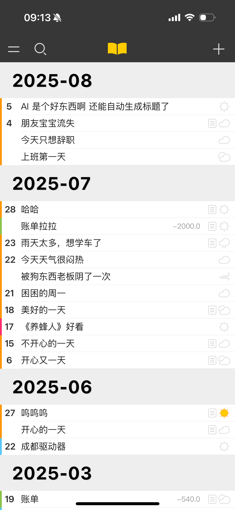
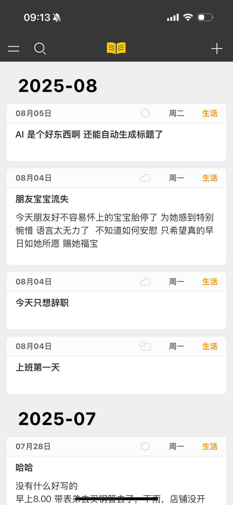
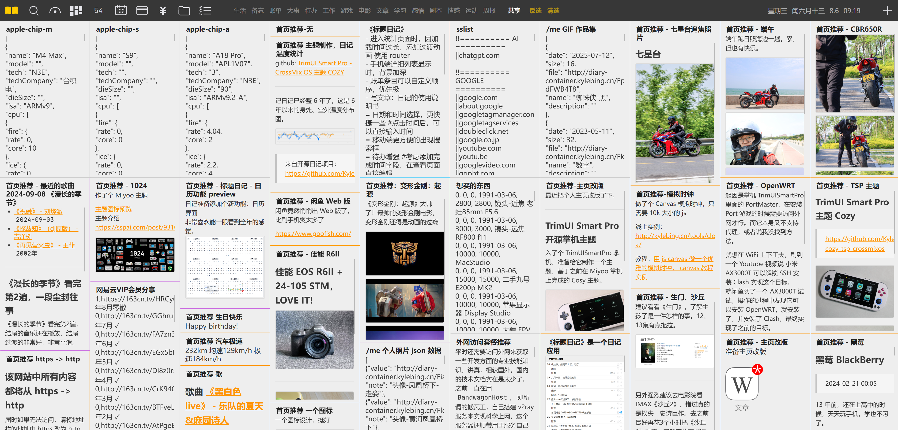

# 不明显的一些功能

除了明面上显示的一些功能之后，有些功能属于比较隐蔽，没有那么明显的。

## 1. 列表模式切换

移动端主页只是一个单纯的标题列表，不能查看带详细内容的列表。

为了实现列表模式切换，我把切换功能添加到了 LOGO 中，移动端点击 LOGO 会在以下两种展示模式之间切换。

PC 端切换是直接点击列表状态按钮

还有一种是：瀑布流，入口在菜单中，显示是这样的：

## 2. 日记编辑的快捷键
日记在编辑状态时，PC 端可以使用快捷键 **Ctrl + S** 快捷保存日记。

在编写日记内容时

| 快捷键                               | 功能                                 |
|-----------------------------------|------------------------------------|
| <kbd>CTRL</kbd>+ <kbd>D </kbd>    | 复制当前行。                             |
| <kbd>Tab</kbd>                    | 在前面插入 4 个空格。                       |
| <kbd>Shift</kbd> + <kbd>Tab</kbd> | 删除行前的空格，多于4个，一次性删除4个，小于四个，清除前面的空格。 |
| <kbd>CTRL</kbd>+ <kbd>← </kbd>    | 移动到行最左端                            |
| <kbd>CTRL</kbd>+ <kbd>→ </kbd>    | 移动到行最右端                            |

