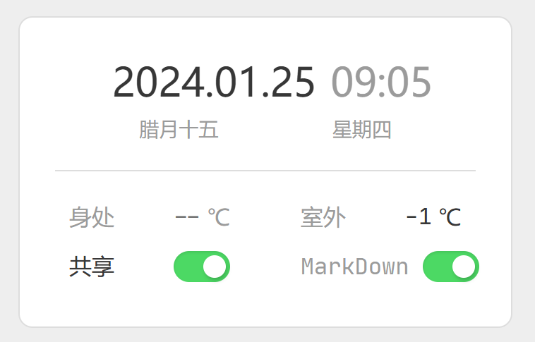
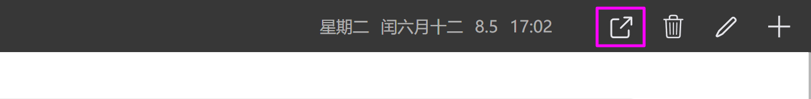
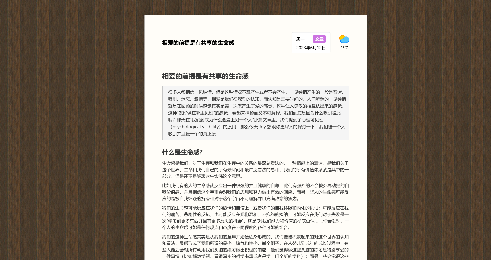

# 共享日记、及其特殊使用方式

## 1. 分享日记
日记可以被标记为公开状态， `is_public === 1`

编辑日记的时候，只需要把`共享`开关打开即可。



## 2. 分享日记内容
在将日记标记成共享状态后，返回查看当前日记，在日记的详情页上方会多出一个共享按钮，点击这个按钮，可以复制当前日记链接。



别人直接访问这个链接就可以查看这条日记内容，会显示成这样。
> [http://kylebing.cn/diary/#/share/11779](http://kylebing.cn/diary/#/share/11779)




## 3. 共享日记数据获取接口

该日记项目还有一个特别有用使用方式，就是可以作为一个数据源使用。  
当日记的属性被设置成公开时，日记内容可以在任何地方被获取到。

```
http://kylebing.cn/portal/diary/get-latest-public-diary-with-keyword?keyword=keyword
```
**keyword** 处填写你的共享的日记标题就可以获取到它的内容

返回格式
```json
{
    "success": true,
    "data": {
        "id": 12769,
        "date": "2024-03-12T03:39:18.000Z",
        "title": "网易云VIP会员分享",
        "content": "1,https://163cn.tv/HRCy6tm,25年8月零散\n0,http://163cn.tv/GGhruFu,25年7月 ✓\n0,http://163cn.tv/FA7zn3C,25年6月 ✓\n0,http://163cn.tv/EGx5bLF,25年5月 ✓\n0,http://163cn.tv/Dl8z0r5,25年4月 ✓\n0,http://163cn.tv/CrK94CE,25年3月 ✓\n0,http://163cn.tv/BTFveLP,25年2月 ✓\n0,http://163cn.tv/AtPgeE2,25年1月 ✓\n0,http://163cn.tv/zAlEeNp,24年12月 ✓\n0,http://163cn.tv/yFGFIFc,24年11月 ✓\n0,http://163cn.tv/xO2aEdS,24年10月 ✓\n0,http://163cn.tv/wX0jL1i,24年9月 ✓\n0,http://163cn.tv/wcI3HTU,24年8月 ✓\n0,http://163cn.tv/vCF6etW,24年7月 ✓\n0,http://163cn.tv/rDQSJ3s,24年6月 ✓\n0,http://163cn.tv/q6QKyED,24年5月 ✓\n0,http://163cn.tv/hWo661,24年4月 ✓\n0,http://163cn.tv/gzFNM1,24年3月 ✓\n0,http://163cn.tv/7RI9V3,24年2月 ✓\n0,http://163cn.tv/iO7iU0,24年1月 ✓\n0,http://163cn.tv/mzkvy0,23年12月 ✓\n0,http://163cn.tv/F9OBP1,23年11月 ✓\n0,http://163cn.tv/0boeU3,23年10月 ✓\n0,http://163cn.tv/LSrKm4,23年9月 ✓\n0,http://163cn.tv/fkG2I3,23年8月 ✓\n0,https://music.163.com/prime/m/gift-receive?d=cudcSllmrPiWoRL-75iaFw&p=5LZK-YHo3G-qjt6UlXPOG4ck6Jsk7bhUjiwQ88OIt2Xsn_D_20LzjzfBCjQBgnAXX5kpVKKVjQ-SjL1Ki-bQxiXupHFgO11lNMfNmD9lGwo&userid=79759260&app_version=8.10.15&dlt=0846,23年7月 ✓\n0,https://music.163.com/prime/m/gift-receive?d=1OtPBYw3FlgNw_YmZudIEg&p=MFpkHLFLKa0C8dsRZxfb0CMLEyGPbKrk2dwKsEwYIrFa5Nofv0xdEJUjuU0qoRvLTlWOV7giNdMlBGZyMsBYfF3PK6VpQzMnM2Xcj-EIGCI&userid=79759260&app_version=8.9.95&dlt=0846,23年6月 ✓\n0,https://music.163.com/prime/m/gift-receive?d=LicTw1fi166OdFT0EswA2A&p=8Hb1nvPLegqPZqAkk1X4xlKMM_KbjkbsHSvVTKQB0fSzhZGdb4zWtvqwkPSXqaPultJrult8QWEaFdu4mzcMcmXfc4AxH7mQAEAzduTiGB0&userid=79759260&app_version=8.9.73&dlt=0846,23年5月 ✓\n0,https://music.163.com/prime/m/gift-receive?d=qj0ojHhiu0XiadIY3n14Ag&p=FIrkti_v2Ux7nPAxiLTOL3_iW9PBWH1hrzpoI7lhENtS7fcgxdLyBrYzERE4B6EW0okiTwMQIODHivr4YxtXpyrYw3DswHQjl7zxSQl7ILA&userid=79759260&app_version=8.9.40&dlt=0846,23年4月 ✓\n0,https://music.163.com/prime/m/gift-receive?d=CaP0cC3Ls3T1co9URbTgLQ&p=W4Dpr9bU3dQx_Fce4ZdCa2efPMAjgLuB8mzayY51SEa8gLyle53tgMFoe7elJQsyBiWsxzudtcr3JHHu521m6bbAgcE7aNSrr0dfN3IDRkA&userid=79759260&app_version=8.9.30&dlt=0846,23年3月 ✓\n0,https://music.163.com/prime/m/gift-receive?d=XG_zS_50_j-DN-MTO9k9yA&p=p_E55KtdeJO5livvCYr0O0MVmIh2jJjC6hCeGii2oJbsch4o2sm8eUvEPzrLvf1QbpP_9B3Nz_vEHk0F_aHZidRNG8PC9VjwqL8u8IuPzto&userid=79759260&app_version=8.9.20&dlt=0846,23年2月 ✓\n",
        "temperature": 23,
        "temperature_outside": 12,
        "weather": "sunny",
        "category": "memo",
        "date_create": "2023-11-16T03:27:11.000Z",
        "date_modify": "2025-08-01T06:30:35.000Z",
        "uid": 3,
        "is_public": 1,
        "is_markdown": 0
    }
}
```


我自己就在多个页面中使用了这个功能，比如：

- [http://kylebing.cn/index/](http://kylebing.cn/index/) 个人主页中的网易云 VIP 会员分享列表，就是从日记中获取的
- [http://kylebing.cn/me/#/gif](http://kylebing.cn/me/#/gif) 列表数据也是从共享日记中获取的

