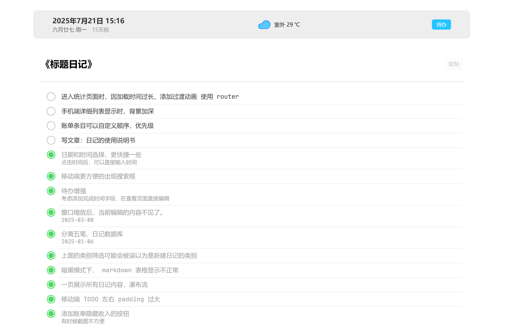

# 日记的展示

日记详情分为多种展示模式：**普通**、**Markdown**、**代码**、**待办列表**、**外部共享**。

## 1. 普通

## 2. Markdown

## 3. Code
当日记内容中包含 `[code]` 这个字段的时候，就会被显示成小字的原始内容

## 4. 待办列表 TODO
当日记类别为 **待办** 时，日记详情会变成待办列表显示。

→ [待办列表](./待办列表)

## 5. 外部共享

关于共享日记 → [共享日记](./共享日记)

