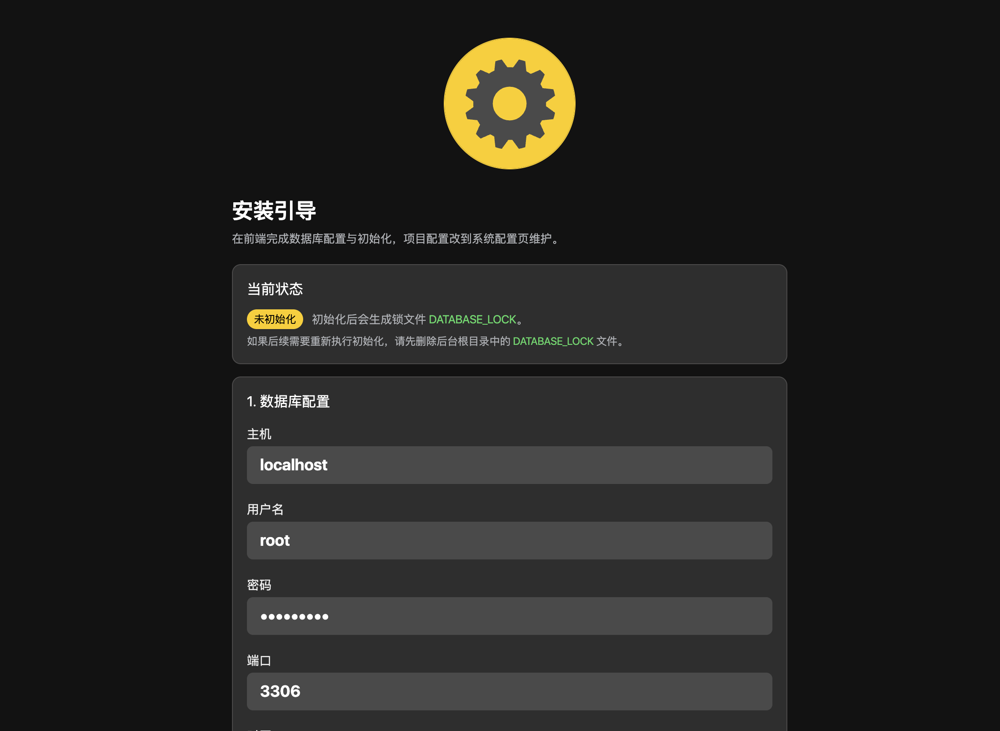
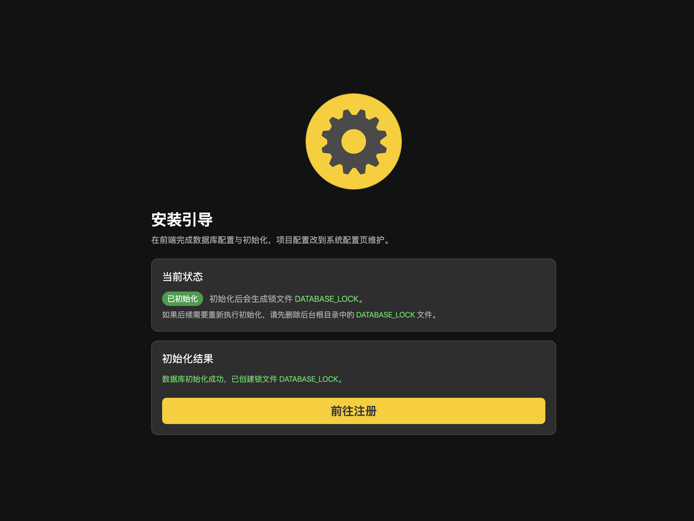
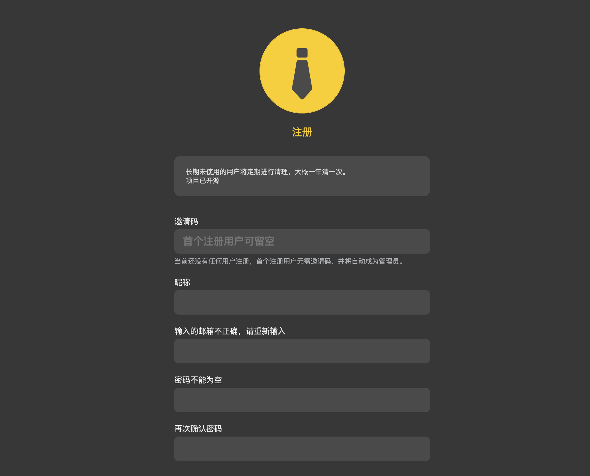
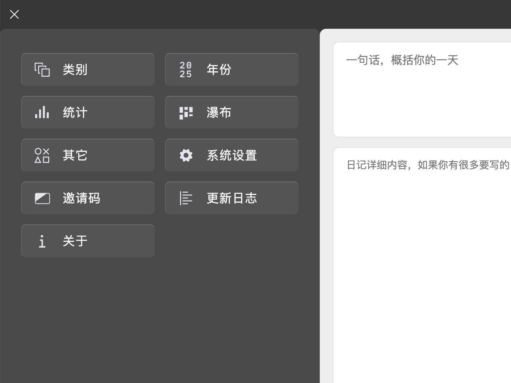
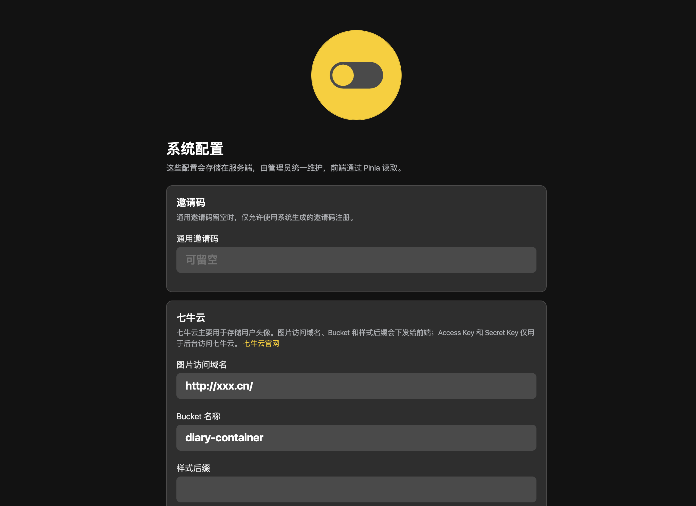
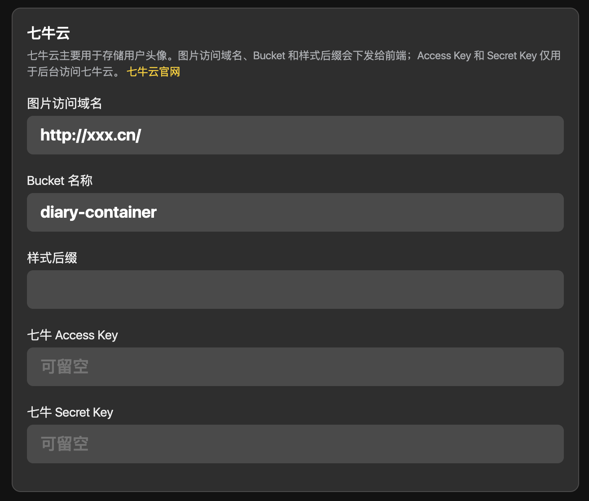
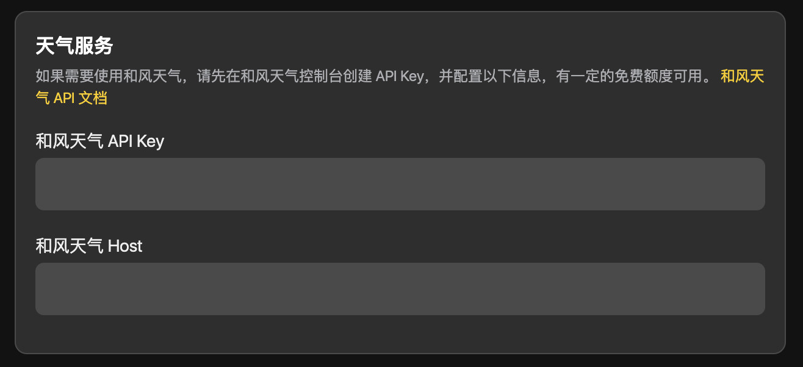
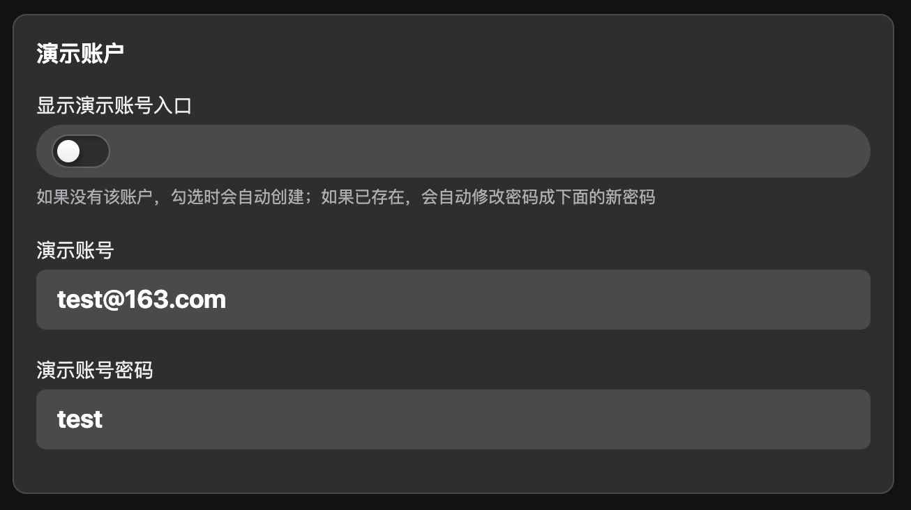

# 部署自己的日记系统

前后端完全开源，你可以部署一套自己的日记系统。  
不过最好你已经具备 linux 服务器的操作能力，会安装指定程序，修改服务配置等。如果你不了解，最好还是直接用现成的。学习起来可能需要点时间。

> 自 v9.40 之后，不再需要手动修改项目文件进行配置，所有配置都可以通过前端进行修改。

---

该项目包含两个部分：

- 前端：[https://github.com/KyleBing/diary-vue](https://github.com/KyleBing/diary-vue) `vue3`、`ts`、`vite`
- 后台：[https://github.com/KyleBing/portal](https://github.com/KyleBing/portal) `nodejs`

默认的部署目录是这样

```sh
[ nginx 文档根目录 ]
      │
      ├── diary      # 前端网页文件夹
      └── portal     # 后台服务文件夹
            ├── bin   
            ├── config
            ├── cron
            ├── dist
            │    ├── bin      # 后台服务的真实入口
            │    ├── config   # 后台配置文件
            │    ├── cron
            │    └── src
            ├── node_modules
            ├── public
            └── src
```


## 一、服务器配置需求

目前没有 docker 的部署方式，还没有实现，我不太会这玩意。  
另外不使用 docker 的方式也有个好处就是，可以在非常低配置的服务器上运行。

你的服务器只需要满足下面的需求即可，因为我的目前就是这样的：
- 带宽 1M 即可
  > 前端项目进行了足够好的优化，加载速度并不慢
- 内存 1G 即可
- 系统最好是 **Ubuntu**
  > 因为我的教程里会以 Ubuntu 为准，当然其它系统也可以实现，只是有些地方会有不同，比如 nginx 的配置目录结构会有不同。

接下来会非常详尽的解说如何部署自己的日记系统，你只需要有基础的 linux 操作能力即可。


## 二、运行环境搭建

不管是在你的电脑端，还是在服务端，都需要安装好的开发环境有：
- **git**    `开发中的版本管理工具`
- **nodejs** v20+ `nodejs环境`
- **npm**  `nodejs 的包管理器`
- **yarn** `nodejs 的包另一个管理器，我习惯用这个`

查看你的系统版本，能看出你系统具体是什么 `debian` `centos` `ubuntu`

```sh
cat /etc/os-release
```

比如我的返回结果就是下面，表明我系统是 **Ubuntu**
```sh
root@aliyun:~# cat /etc/os-release
PRETTY_NAME="Ubuntu 22.04.1 LTS"
NAME="Ubuntu"
VERSION_ID="22.04"
VERSION="22.04.1 LTS (Jammy Jellyfish)"
VERSION_CODENAME=jammy
ID=ubuntu
ID_LIKE=debian
HOME_URL="https://www.ubuntu.com/"
SUPPORT_URL="https://help.ubuntu.com/"
BUG_REPORT_URL="https://bugs.launchpad.net/ubuntu/"
PRIVACY_POLICY_URL="https://www.ubuntu.com/legal/terms-and-policies/privacy-policy"
UBUNTU_CODENAME=jammy
```

### 1. 安装 git
Linux 服务器中一般都默认安装了 git，不需要额外处理。  
如果你是 Windows、Mac，需要自行问[豆包][doubao_link]如何安装，不再冗述。

### 2. 安装 nodejs v20+
知道你系统是什么之后，去问[豆包][doubao_link]，在你的系统中该如何安装 nodejs，它就会告诉你该用什么指令安装，现在(2025.11.08)默认安装的 nodejs 都是 v20+ 的。

安装完成之后，通过以下指令检查是否安装成功

```sh
node -v
# 正确安装之后，它会显示对应的 nodejs 版本号
```
```sh
# 像这样
root@aliyun:~# node -v 
v20.18
```
安装 nodejs 完成之后，它会默认安装 npm，所以 npm 就不用额外管了。

### 3. 安装 yarn

**yarn** 是包管理器，跟 **npm** 一样的东西。

执行

```sh
npm i -g yarn

# 它是 npm install -g yarn 的缩写
# 它会全局安装 yarn 指令
```

检查是否安装成功是一样的

```sh
yarn -v
```
```sh
# 比如，像我的，显示版本号就表示安装成功
root@aliyun:~# yarn -v
1.22.19
```


## 三、部署前端
直接下载对应版本的前端文件，解压到你的服务器指定目录就可以了。

将上面生成的那个 `diary-xxxx-xx-xx.zip` 文件，上传到服务器，再将其解压到 `web根目录/diary/` 目录下。就完成了。

> 这个 web 根目录可以由你来决定，要么直接使用 nginx 服务的默认主目录，要么你自己选择一个位置，只要你知道主目录是哪一个就行。

这一步是基础的服务器操作，就不细说了，不明白可以问 [豆包][doubao_link]


## 四、部署后台服务

后台部署要相对麻烦一些，大概需要这几个步骤：

1. 安装运行环境
   - 安装 `mysql` 数据库
   - 安装 `nodejs` `npm` `yarn` `git` 环境，第二章 里面的内容
   - 安装 `pm2`
   - 安装 `nginx` **网页服务软件**
2. 下载后台程序
3. 修改后台服务配置
4. 用 `pm2` 启动后台服务
5. 初始化系统 `创建数据库表结构`


### 1. 安装运行环境

1. `nodejs`、`npm`、`yarn`、`git` 的安装方式在第二章里已经写明了
2. `mysql` 的安装和配置方式，去问 [豆包][doubao_link]，这里只需要最终能提供出 `数据库用户名`、`密码`、`端口号` 即可，用于配置以下内容
3. 安装 `nginx`，这个也去问 [豆包][doubao_link] 吧，就是在服务器上装个普通程序一样。


### 2. 下载后台程序 nodejs

登录你的服务器，进入 web 主目录，终端中执行

```shell
git clone https://github.com/KyleBing/portal.git
```
会在 web 目录中创建一个名为 **portal** 的目录，里面放置好了后台程序的所有文件。

**portal** 的目录结构是这样的

```shell
web根目录/portal/
            ├── bin
            ├── config
            ├── cron
            ├── dist
            │   ├── bin
            │   ├── config
            │   ├── cron
            │   └── src
            ├── node_modules
            ├── public
            │   └── stylesheets
            └── src
                ├── diary
                ├── dontstarve
                ├── entity
                ├── file
                ├── imageQiniu
                ├── init
                ├── map
                ├── qr
                ├── response
                ├── statistic
                ├── thumbsUp
                ├── user
                └── wubi
```

### 3. 使用 pm2 启动后台服务

在启动后台服务之前，需要安装另外一个工具来管理 nodejs 的程序，因为后台是 nodejs 写的。

这个工具名叫 **pm2**，可以方便的管理 nodejs 后台服务。
> 想了解它的更多使用方法请参阅： [pm2 使用教程： 管理你的 nodejs 后台项目](https://blog.csdn.net/KimBing/article/details/124249590)

1. 安装 **pm2**，执行
    ```shell
    npm i -g pm2
    ```
2. 启动服务，进入 `web根目录/portal/dist/bin` 目录
    ```shell
    pm2 start ./portal.js --name portal
   
    # 指令释义
   pm2 start        # 使用 pm2 启动 nodejs 项目
   ./portal.js      # 执行程序是 ./portal.js
   --name portal    # 给它命名为 portal
    ```
   然后会看到一个表，表上显示着后台项目的名字和运行状态。过一会再执行一次下面指令查看运行情况，
   
    ```shell
    pm2 status
    ```
   如果看到状态栏显示 **error**，使用 `pm2 log` 的指令查看具体的错误信息排查问题所在。
3. 完成之后，服务就正常运行在了你机器的 3000 端口，当你用浏览器访问 `你的ip:3000` 时，应该会看到下面的信息：  
   比如我的 `kylebing.cn:3000`
    ```json
    { 
       "status":"success",
       "message":"Portal API is running",
       "title":"Portal for Diary"
    }
    ```
   


## 五、nginx 配置

我们来梳理一下目前的目录和程序：

- 后台服务运行在 `localhost:3000`
- 前端运行在 `localhost/diary/`

```shell
[ nginx 文档根目录 ]
      │
      ├── diary   # 已放置好前端页面
      └── portal  # 目前这个是缺失的 #####
```

接下来要做的就是将 `localhost:3000` 的服务代理到 `/portal` 路径上去，这个就需要修改 `nginx` 配置文件。

如何找到 nginx 配置文件目录和配置文件 请自行豆包，不同系统的 nginx 配置文件放置位置可能会有不同，但配置文件的内容是一致的。

比如 **ubuntu** 的 **nginx** 配置文件目录就是在 `/etc/nginx/nginx.conf`

根据这个格式添加对应内容。

```nginx
map $http_upgrade $connection_upgrade {
        default upgrade;
        '' close;
}

upstream ws_server {
    server localhost:9999;
    keepalive 2000;
}

upstream portal_server {
    server localhost:3000;
    keepalive 2000;
}

server {
        listen 80 default_server;
        listen [::]:80 default_server;

        root /var/www/html;  # 修改成你的 web 根目录路径
        index index.html index.htm index.nginx-debian.html;
        server_name diary;  # 这个自定义就好
        
                ##
        # Gzip Settings
        ##

        gzip on;

         gzip_vary on;
         gzip_proxied any;
         gzip_comp_level 6;
         gzip_buffers 16 8k;
         gzip_http_version 1.1;
         gzip_types text/plain text/css application/json application/javascript text/xml application/xml application/xml+rss text/javascript;


        location / {
                add_header Access-Control-Allow-Origin * always;
                try_files $uri $uri/ =404;
                # rewrite ^(.*)$ https://$host$1; #将所有HTTP请求通过rewrite指令重定向到HTTPS。
        }

       location /portal/ {
            add_header Access-Control-Allow-Origin * always;
            proxy_pass http://portal_server/;
            proxy_set_header Host $host:$server_port;
        }
    
       location /ws {
          proxy_pass http://ws_server;
          proxy_http_version 1.1;
          proxy_set_header Upgrade $http_upgrade;
          proxy_set_header Connection "upgrade";
        }
}
```

修改完成之后，重启 nginx 服务
```shell
systemctl restart nginx
```

如果出现错误，就根据提示排查下错误。


## 六、系统初始化

如果上面的所有步骤都对，现在再用浏览器访问你的 diary 就会出现初始化的页面。
> 初始化页面只在第一次初始化的时候显示，之后将不再显示。

### 1. 填写数据库信息
根据提示填写数据库信息，保存之后，去后台重启你的后台服务。





### 2. 初始化
> 注意：初始化会清空 `diary` 数据库中的所有内容

1. 初始化数据库会自动创建一个名为 `diary` 的数据库。
2. 初始化后，会自动在项目目录中新建一个名为 `DATABASE_LOCK` 的文件，之后将不能再执行这个接口，如果想再次初始化，需要先删除这个文件。

> **建议定期自行备份数据库**

### 3. 注册第一个用户
第一个注册的用户自动变更为管理员，且第一个用户注册的时候不需要邀请码。




## 七、系统配置

注册完成之后，登录系统，点击【菜单】，找到【系统配置】
> **系统配置** 该菜单只有管理员用户能看到，其它人看不到，也无法设置




### 1. 邀请码

新用户注册需要邀请码，邀请码分为两种：
- **万能的**：在后台系统的配置文件中配置
- **一次性**：一人一码

1. 登入前端日记系统后，点开菜单，选择邀请码菜单，可以生成新的邀请码，点击邀请码就可以复制内容，分享给别人就可以了。
   > 系统安装后，第一个注册的用户默认为管理员，即 `group_id` = `1`  
   > 用户默认注册后的 `group_id` 为 `2`
2. 邀请码页面中显示的是都是未注册的码，复制后邀请码变为绿色，表示已被分享还未使用。
3. 已使用的将会隐藏，不再显示在列表中。


### 2. 图片存储配置 `[选配]`
> 如若不配置：只是不能显示用户头像而已  

头像文件是存储到 [七牛云](https://www.qiniu.com/) 上的，免费注册会有免费额度，够用。  



### 3. 和风天气配置 `[选配]`
> 如若不配置：只是不能自动获取当地天气和温度而已  
用于从 [和风天气](https://www.qweather.com/) 中获取地域的天气和温度信息，也是在 `/config/projectConfig.json` 文件中




### 4. 演示账户
可以开启或关闭演示账户的显示。

- 开启：会自动创建并设置对应的账户密码，在登录页会显示演示账户入口
- 关闭：登录页将不再显示演示账户入口




[//]: # (外链字义区域)
[doubao_link]: https://www.doubao.com/

