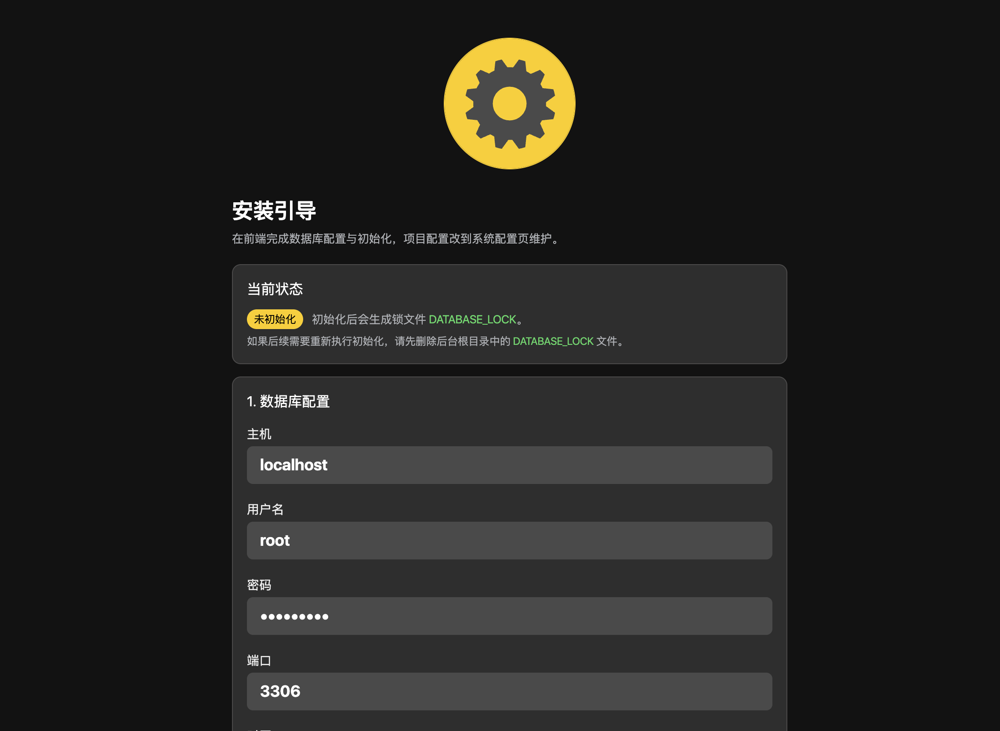
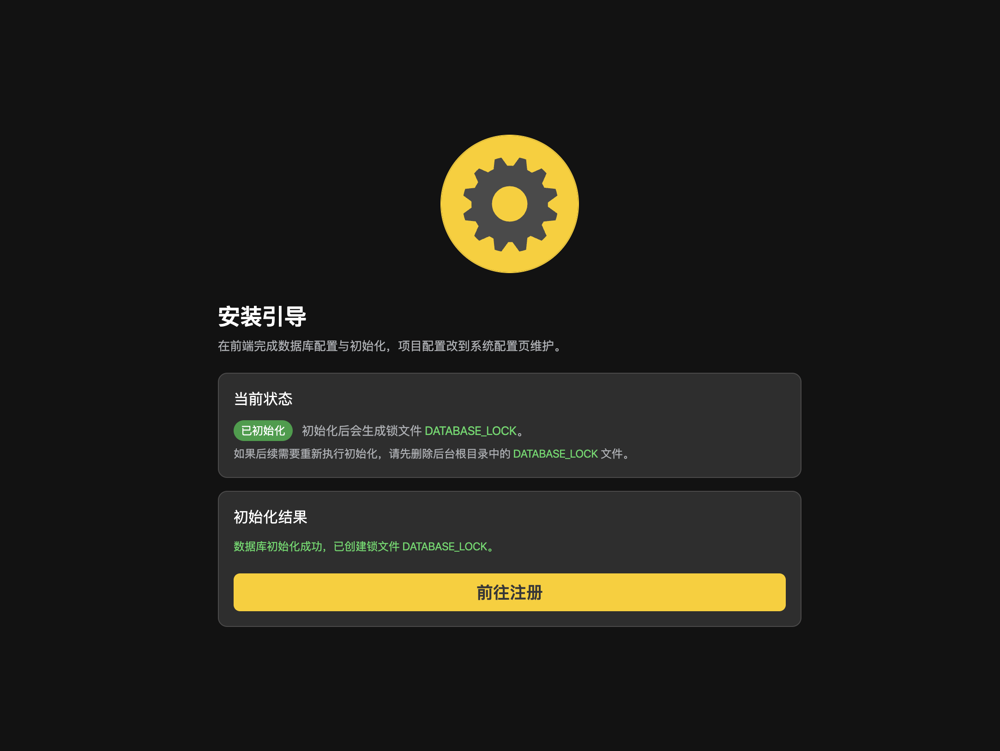
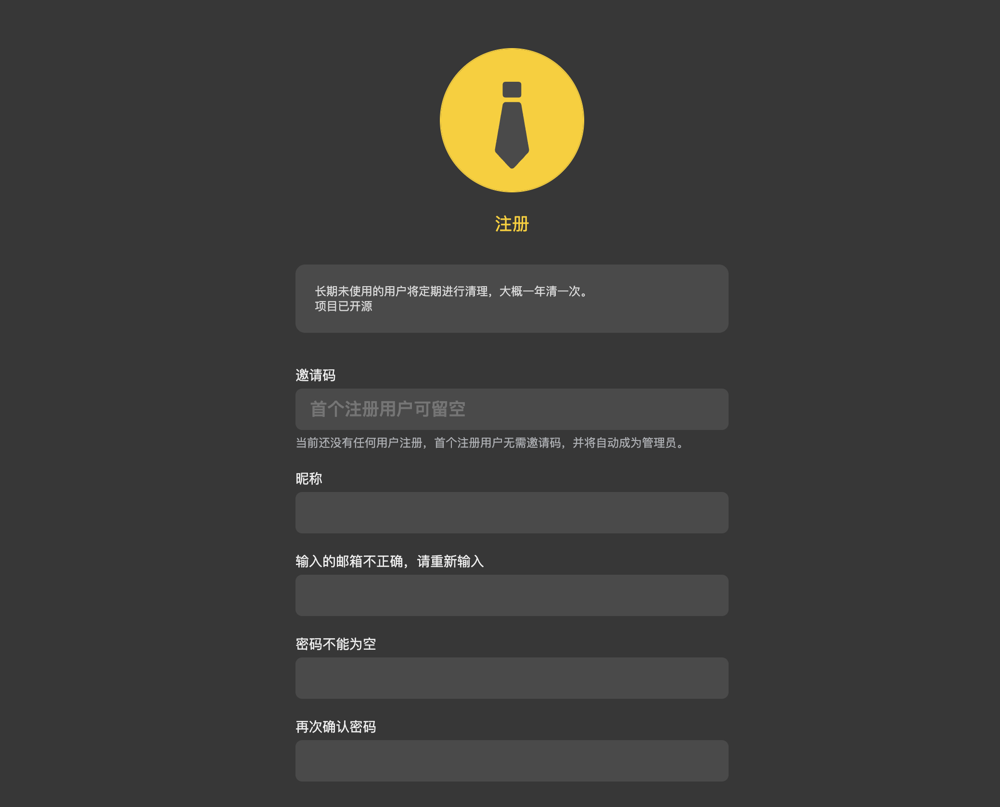
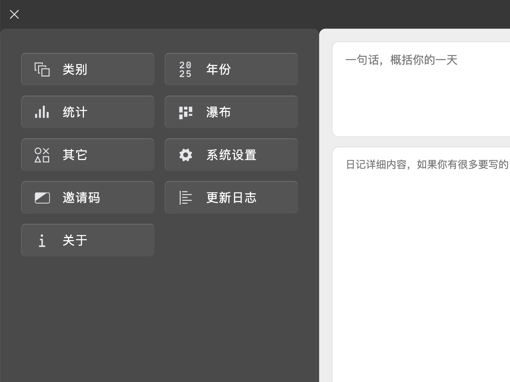
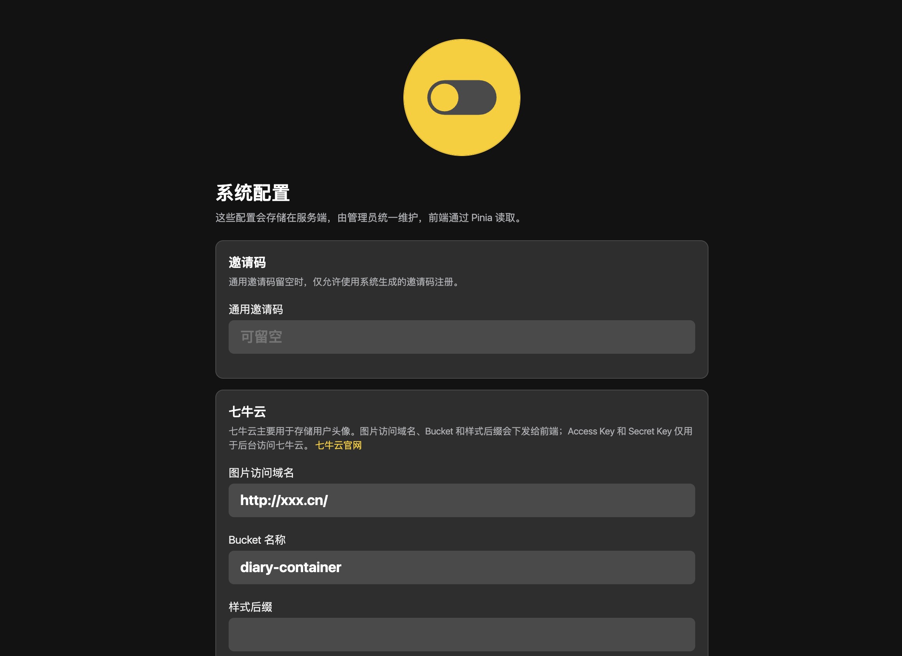
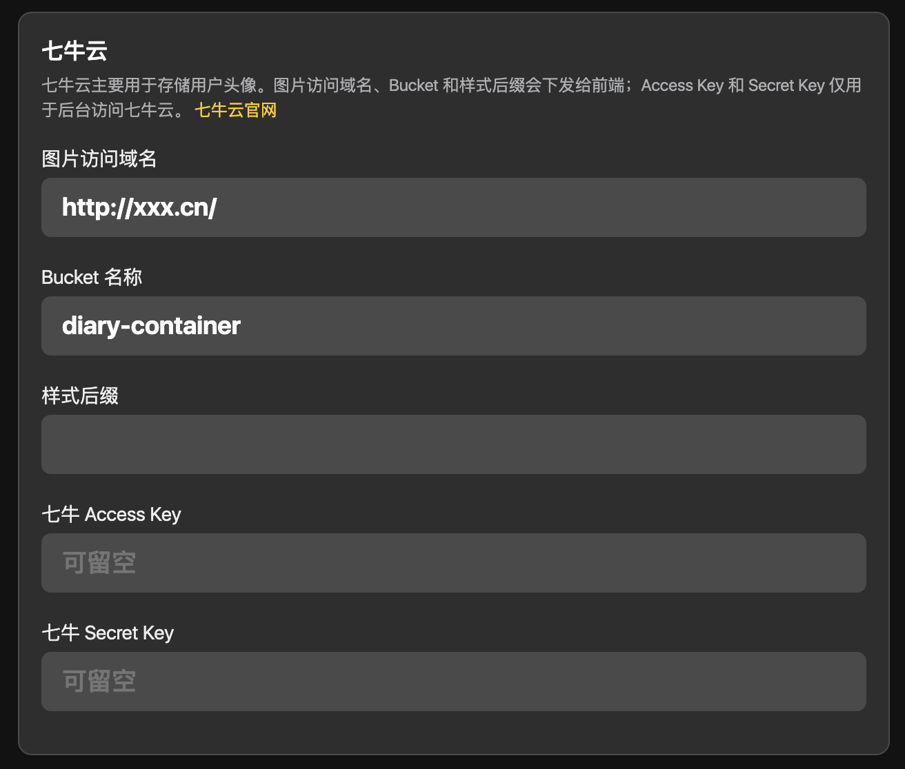
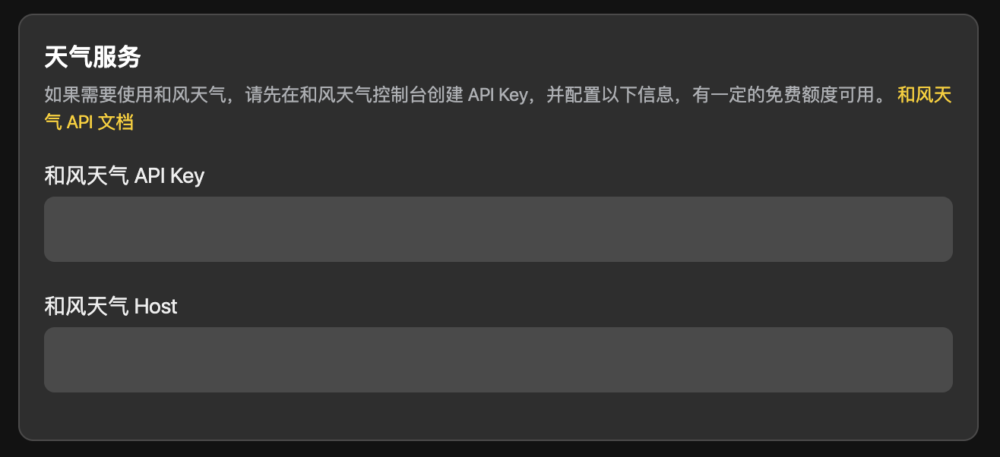
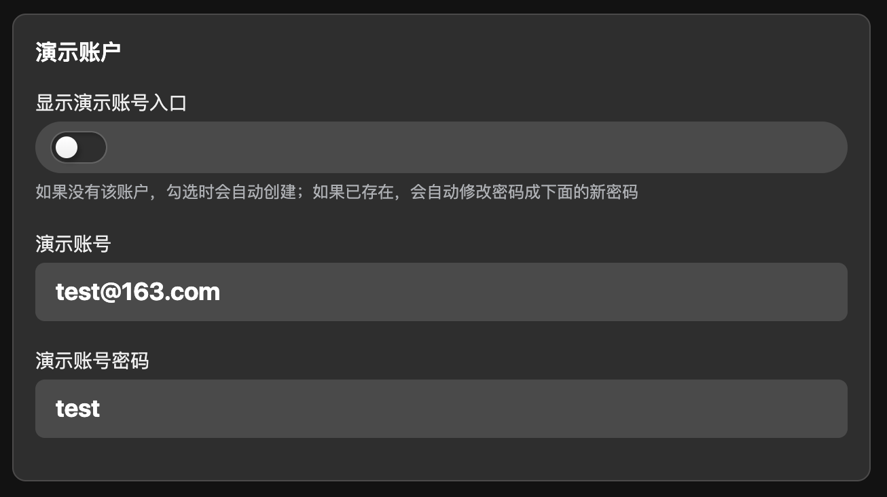

# 部署自己的日记系统

> v9.40 之后 · 后台已切换为 [portal-go](https://github.com/KyleBing/portal-go)（Go）

前后端完全开源，你可以部署一套自己的日记系统。
> 不过最好你已经具备 linux 服务器的操作能力，会安装指定程序，修改服务配置等。如果你不了解，最好还是直接用现成的。学习起来可能需要点时间。

该项目包含两个部分：

- 前端：[https://github.com/KyleBing/diary-vue](https://github.com/KyleBing/diary-vue) `vue3`、`ts`、`vite`
- 后台：[https://github.com/KyleBing/portal-go](https://github.com/KyleBing/portal-go) `go`（API 路径仍为 `/portal/`，与旧版兼容）

默认的部署目录是这样

```sh
[ nginx 文档根目录 ]
      │
      ├── diary         # 前端网页文件夹
      └── portal-go     # 后台服务文件夹
            ├── bin
            │    ├── portal   # API 主程序 :3000
            │    ├── ws       # WebSocket :9999
            │    └── cron     # 定时任务
            ├── config
            │    └── configDatabase.json
            ├── migrations
            │    └── init.sql
            ├── upload
            └── web
                 └── manager
                      └── dist   # 管理后台静态页 /manager/
```


## 一、服务器配置需求

后台是单个 Go 二进制，内存占用很低，也可以用仓库自带的 `Dockerfile` 跑。  
不用 docker 的好处是：可以在非常低配置的服务器上直接跑二进制。

你的服务器只需要满足下面的需求即可，因为我的目前就是这样的：
- 带宽 1M 即可
  > 前端项目进行了足够好的优化，加载速度并不慢
- 内存 1G 即可
- 系统最好是 **Ubuntu**
  > 因为我的教程里会以 Ubuntu 为准，当然其它系统也可以实现，只是有些地方会有不同，比如 nginx 的配置目录结构会有不同。

接下来会非常详尽的解说如何部署自己的日记系统，你只需要有基础的 linux 操作能力即可。


## 二、运行环境搭建

按角色区分一下需要装什么：

| 环境 | 需要 |
|------|------|
| **服务器** | `git`、`mysql`、`nginx`、（可选）`go` 1.22+ |
| **本机编译 / 一键部署** | `go` 1.22+；若要编管理后台还需要 `nodejs` v20+、`yarn` |

服务器上如果只跑已经编译好的二进制，**不必**装 Node.js，也**不必**装 pm2。

查看你的系统版本，能看出你系统具体是什么 `debian` `centos` `ubuntu`

```sh
cat /etc/os-release
```

比如我的返回结果就是下面，表明我系统是 **Ubuntu**
```sh
root@aliyun:~# cat /etc/os-release
PRETTY_NAME="Ubuntu 22.04.1 LTS"
NAME="Ubuntu"
VERSION_ID="22.04"
VERSION="22.04.1 LTS (Jammy Jellyfish)"
VERSION_CODENAME=jammy
ID=ubuntu
ID_LIKE=debian
HOME_URL="https://www.ubuntu.com/"
SUPPORT_URL="https://help.ubuntu.com/"
BUG_REPORT_URL="https://bugs.launchpad.net/ubuntu/"
PRIVACY_POLICY_URL="https://www.ubuntu.com/legal/terms-and-policies/privacy-policy"
UBUNTU_CODENAME=jammy
```

### 1. 安装 git
Linux 服务器中一般都默认安装了 git，不需要额外处理。  
如果你是 Windows、Mac，需要自行问[豆包][doubao_link]如何安装，不再冗述。

### 2. 安装 Go 1.22+（本机编译或服务器本机构建时需要）
去问[豆包][doubao_link]，在你的系统中该如何安装 Go，装好后检查：

```sh
go version
# 需要 go1.22 或更高，例如 go1.22.5
```

### 3. 安装 nodejs / yarn（仅在需要构建管理后台时）
管理后台 `web/manager` 是 Vue 项目。若使用仓库的 `./build.sh` 且不带 `--no-frontend`，本机需要：

```sh
node -v   # v20+
npm i -g yarn
yarn -v
```

只部署日记前端（release 包）+ 后台 API、不部署 `/manager/` 时，可以跳过这一步，构建时加 `--no-frontend`。


## 三、部署前端
直接去 [release 页面](https://github.com/KyleBing/diary/releases) 下载对应版本的前端文件，解压到你的服务器指定目录就可以了。

将上面下载的 `diary-xxxx-xx-xx.zip` 文件，上传到服务器，再将其解压到 `web根目录/diary/` 目录下。就完成了。

> 这个 web 根目录可以由你来决定，要么直接使用 nginx 服务的默认主目录，要么你自己选择一个位置，只要你知道主目录是哪一个就行。

这一步是基础的服务器操作，就不细说了，不明白可以问 [豆包][doubao_link]


## 四、部署后台服务（portal-go）

后台部署大概需要这几个步骤：

1. 安装运行环境
   - 安装 `mysql` 数据库
   - 安装 `nginx`
   - （可选）本机或服务器安装 `go` 1.22+
2. 下载 / 编译后台程序
3. 修改数据库配置 `config/configDatabase.json`
4. 用 `systemd` 启动 `portal-go`、`portal-ws`
5. 初始化系统 `创建数据库表结构`


### 1. 安装运行环境

1. `mysql` 的安装和配置方式，去问 [豆包][doubao_link]，这里只需要最终能提供出 `数据库用户名`、`密码`、`端口号` 即可
2. 安装 `nginx`，这个也去问 [豆包][doubao_link] 吧，就是在服务器上装个普通程序一样。


### 2. 下载后台程序

登录你的服务器，进入 web 主目录，终端中执行

```shell
git clone https://github.com/KyleBing/portal-go.git
```
会在 web 目录中创建一个名为 **portal-go** 的目录。

**portal-go** 的目录结构大致是这样的

```shell
web根目录/portal-go/
            ├── bin/                 # 编译产物放这里
            ├── build.sh             # 一键交叉编译 + 部署
            ├── cmd/
            │   ├── portal/
            │   ├── ws/
            │   └── cron/
            ├── config/
            │   ├── configDatabase.example.json
            │   └── configDatabase.json
            ├── migrations/
            │   └── init.sql
            ├── internal/
            └── web/manager/         # 管理后台源码
```

#### 方式 A：本机一键编译并部署（推荐）

在你自己的电脑上（已装好 Go）：

```shell
git clone https://github.com/KyleBing/portal-go.git
cd portal-go
cp deploy.env.example deploy.env   # 按需改主机、路径
cp config/configDatabase.example.json config/configDatabase.json
# 编辑 configDatabase.json 填好数据库信息

./build.sh                         # linux/amd64 编译 + rsync + migrate + 重启
./build.sh --no-deploy             # 只编译，不上传
./build.sh --no-frontend           # 不构建 manager
```

`build.sh` 会：交叉编译 `portal` / `ws` / `cron` → rsync 到服务器 `DEPLOY_PATH` → 远程执行 `./bin/portal migrate` → `systemctl restart portal-go portal-ws`。

#### 方式 B：在服务器上直接编译

```shell
cd web根目录/portal-go
cp config/configDatabase.example.json config/configDatabase.json
# 编辑配置后
make backend
# 得到 bin/portal、bin/ws、bin/cron
./bin/portal migrate
```


### 3. 配置数据库

编辑 `config/configDatabase.json`（可参考 `configDatabase.example.json`）：

```json
{
  "host": "127.0.0.1",
  "user": "root",
  "password": "你的密码",
  "port": 3306,
  "multipleStatements": true,
  "timezone": ""
}
```


### 4. 使用 systemd 启动后台服务

不再使用 pm2。创建两个服务文件：

`/etc/systemd/system/portal-go.service`

```ini
[Unit]
Description=Portal Go API
After=network.target

[Service]
Type=simple
WorkingDirectory=/var/www/html/portal-go
ExecStart=/var/www/html/portal-go/bin/portal
Restart=on-failure
Environment=PORT=3000

[Install]
WantedBy=multi-user.target
```

`/etc/systemd/system/portal-ws.service`

```ini
[Unit]
Description=Portal Go WebSocket
After=network.target

[Service]
Type=simple
WorkingDirectory=/var/www/html/portal-go
ExecStart=/var/www/html/portal-go/bin/ws
Restart=on-failure

[Install]
WantedBy=multi-user.target
```

> 把路径改成你实际的 `web根目录/portal-go`。

然后执行：

```shell
systemctl daemon-reload
systemctl enable --now portal-go portal-ws
systemctl status portal-go portal-ws
```

若状态异常，用 `journalctl -u portal-go -e` 查看日志。

完成之后，服务跑在本机 **3000**（API）和 **9999**（WebSocket）。浏览器访问 `你的ip:3000` 时，应该会看到：

```json
{
   "status":"success",
   "message":"Portal API is running",
   "title":"Portal for Diary"
}
```

（可选）用户计数刷新 cron：

```cron
17 * * * * cd /var/www/html/portal-go && ./bin/cron
```


## 五、nginx 配置

我们来梳理一下目前的目录和程序：

- 后台 API 运行在 `localhost:3000`（含 `/portal/`、`/manager/`）
- WebSocket 运行在 `localhost:9999`
- 前端日记运行在 `localhost/diary/`

```shell
[ nginx 文档根目录 ]
      │
      ├── diary       # 已放置好前端页面
      └── portal-go   # 后台程序目录
```

接下来要做的就是把后端反代出去：对外仍使用 **`/portal/`** 路径（前端日记接口地址不变），管理后台走 **`/manager/`**。

如何找到 nginx 配置文件目录和配置文件 请自行豆包，不同系统的 nginx 配置文件放置位置可能会有不同，但配置文件的内容是一致的。

比如 **ubuntu** 的 **nginx** 配置文件目录就是在 `/etc/nginx/nginx.conf`

根据这个格式添加对应内容。

```nginx
map $http_upgrade $connection_upgrade {
        default upgrade;
        '' close;
}

upstream portal_server {
    server 127.0.0.1:3000;
    keepalive 2000;
}

upstream ws_server {
    server 127.0.0.1:9999;
    keepalive 2000;
}

server {
        listen 80 default_server;
        listen [::]:80 default_server;

        root /var/www/html;  # 修改成你的 web 根目录路径
        index index.html index.htm index.nginx-debian.html;
        server_name diary;  # 这个自定义就好
        
                ##
        # Gzip Settings
        ##

        gzip on;

         gzip_vary on;
         gzip_proxied any;
         gzip_comp_level 6;
         gzip_buffers 16 8k;
         gzip_http_version 1.1;
         gzip_types text/plain text/css application/json application/javascript text/xml application/xml application/xml+rss text/javascript;


        location / {
                add_header Access-Control-Allow-Origin * always;
                try_files $uri $uri/ =404;
                # rewrite ^(.*)$ https://$host$1; #将所有HTTP请求通过rewrite指令重定向到HTTPS。
        }

       location /portal/ {
            add_header Access-Control-Allow-Origin * always;
            proxy_pass http://portal_server/portal/;
            proxy_set_header Host $host:$server_port;
        }

       location /manager/ {
            proxy_pass http://portal_server/manager/;
            proxy_set_header Host $host:$server_port;
        }
    
       location /ws {
          proxy_pass http://ws_server/;
          proxy_http_version 1.1;
          proxy_set_header Upgrade $http_upgrade;
          proxy_set_header Connection $connection_upgrade;
        }
}
```

> 注意：`proxy_pass` 要保留路径前缀 `/portal/`，与旧 Node 版「剥掉前缀」的写法不同。

修改完成之后，重启 nginx 服务
```shell
systemctl restart nginx
```

如果出现错误，就根据提示排查下错误。


## 六、系统初始化

如果上面的所有步骤都对，现在再用浏览器访问你的 diary 就会出现初始化的页面。
> 初始化页面只在第一次初始化的时候显示，之后将不再显示。

### 1. 填写数据库信息
根据提示填写数据库信息，保存之后，重启后台服务：

```shell
systemctl restart portal-go
```





### 2. 初始化
> 注意：初始化会清空 `diary` 数据库中的所有内容

1. 初始化数据库会自动创建一个名为 `diary` 的数据库。
2. 初始化后，会自动在项目目录中新建一个名为 `DATABASE_LOCK` 的文件，之后将不能再执行这个接口，如果想再次初始化，需要先删除这个文件。
3. 后续表结构变更可用 `./bin/portal migrate`（增量 SQL 已嵌入二进制）。

> **建议定期自行备份数据库**

### 3. 注册第一个用户
第一个注册的用户自动变更为管理员，且第一个用户注册的时候不需要邀请码。




## 七、系统配置

注册完成之后，登录系统，点击【菜单】，找到【系统配置】
> **系统配置** 该菜单只有管理员用户能看到，其它人看不到，也无法设置




### 1. 邀请码

新用户注册需要邀请码，邀请码分为两种：
- **万能的**：在后台系统的配置中配置
- **一次性**：一人一码

1. 登入前端日记系统后，点开菜单，选择邀请码菜单，可以生成新的邀请码，点击邀请码就可以复制内容，分享给别人就可以了。
   > 系统安装后，第一个注册的用户默认为管理员，即 `group_id` = `1`  
   > 用户默认注册后的 `group_id` 为 `2`
2. 邀请码页面中显示的是都是未注册的码，复制后邀请码变为绿色，表示已被分享还未使用。
3. 已使用的将会隐藏，不再显示在列表中。


### 2. 图片存储配置 `[选配]`
> 如若不配置：只是不能显示用户头像而已

头像文件是存储到 [七牛云](https://www.qiniu.com/) 上的，免费注册会有免费额度，够用。  
在【系统配置】里填写即可。  



### 3. 和风天气配置 `[选配]`
> 如若不配置：只是不能自动获取当地天气和温度而已  
用于从 [和风天气](https://www.qweather.com/) 中获取地域的天气和温度信息，同样在【系统配置】中填写。




### 4. 演示账户
可以开启或关闭演示账户的显示。

- 开启：会自动创建并设置对应的账户密码，在登录页会显示演示账户入口
- 关闭：登录页将不再显示演示账户入口




[//]: # (外链字义区域)
[doubao_link]: https://www.doubao.com/
