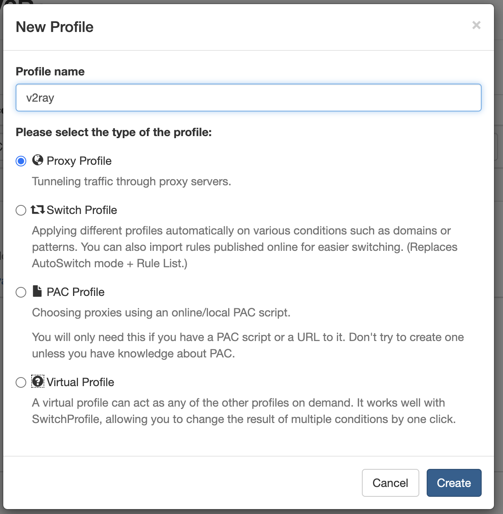

# v2ray Chrome 插件使用

## 一、下载 ProxyOmega 插件

如果不能正常使用 Google Chrome 插件商店，就从这里下载：
> [https://kylebing.cn/download/files/SwitchyOmega_Chromium.crx](https://kylebing.cn/download/files/SwitchyOmega_Chromium.crx)

## 二、安装插件

打开 Chrome 浏览器的扩展程序窗口，把开发者模式打开，将下载好的插件挺进去即可

## 三、配置

### 1. 打开配置
右击插件图标，在弹出的菜单中选择 <kbd>Option</kbd>

### 2.新建一个场景
点击左侧按钮 <kbd>New profile</kbd>

输入场景名

### 3. 配置场景
根据图中所示设置这个场景，然后点击保存

## 四、设置根据规则自动切换

## 五、设置快速切换
